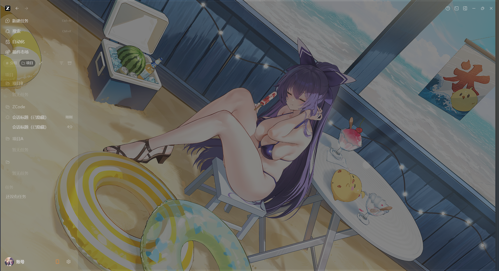
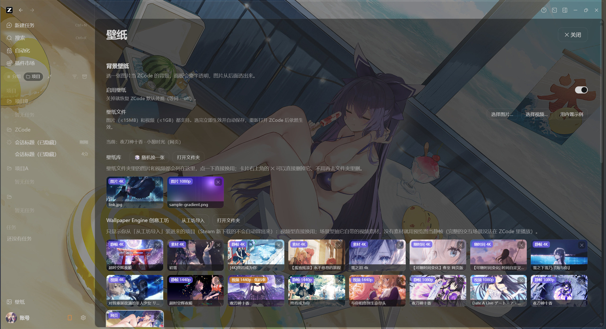
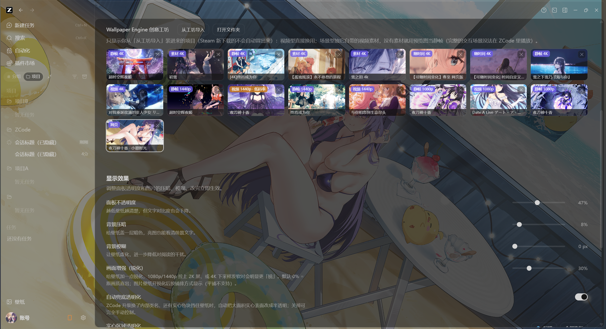

# ZCode 壁纸（zcode-bg）

给 **ZCode 桌面版**（Electron 客户端）加上**动态壁纸 + 毛玻璃透明**：图片、视频、网页都能当壁纸，
侧栏 / 面板 / 头部半透明地把壁纸透出来。所有操作都在 **ZCode 应用内的「壁纸」设置页**完成，
**不修改 ZCode 的任何安装文件**（不动 `app.asar`），随时可完全恢复原样。

**最特别的一点：直接适配 Wallpaper Engine 创意工坊。**
Steam 上订阅的工坊壁纸不用导出、不用转换，重启工具就出现在 ZCode 里——视频型直接播、
场景型自动抽取 4K 素材、网页型（spine）原生渲染，还支持「随时间自动换」的工坊壁纸。

| 壁纸 + 毛玻璃侧栏 | 应用内「壁纸」设置面板 | Wallpaper Engine 创意工坊区块 |
| --- | --- | --- |
|  |  |  |

> 上图为实际运行截图（演示环境已做隐私脱敏）。当前壁纸是创意工坊里的 spine 网页壁纸，正在 ZCode 里原生渲染。

---

## ✨ 特性一览

- **零依赖、单文件**：一个 `zcode-bg.mjs`（Node.js ≥ 22，零第三方依赖），没有 Python、没有 npm install、没有打包体积。
- **不改 ZCode 的任何文件**：用 `--remote-debugging-port` 启动 ZCode，再通过 DevTools 协议（CDP）注入 CSS / 界面脚本；退出脚本或重启 ZCode 就完全恢复原样。
- **应用内设置面板**：ZCode 侧栏底部多出一个「壁纸」入口，换壁纸、调透明度、切铺排方式都在应用内拖滑块完成，**松手即保存**，重启后依然生效。
- **三种壁纸**：图片（png/jpg/webp/gif/avif/bmp/svg）、视频（mp4/webm…循环播放）、**网页壁纸**（spine / HTML 项目直接上墙）。
- **毛玻璃透明**：面板类自动半透明跟随主题；「🔍 扫描」把挡壁纸的实心区域逐个列出、点开关就透明化，还能给每块区域 🎨 调任意颜色 + 不透明度，不用懂 CSS。
- **画质不缩水**：视频原文件直连播放不重编码；素材静帧优先无损抽取；卡片角标如实标注真实分辨率 / 码率，低码率假 4K 一眼识破；还有「画面增强（锐化）」滑块救发软的素材。
- **壁纸库 + 🎲 随机换一张**：选过的图/视频自动进库（缩略图网格），拖拽进面板也能直接换，选择困难症一键随机。
- **视频控制**：静音循环、0.25×–4× 变速、切后台自动暂停省电、Range 拖进度。
- **自动兜底**：ZCode 升级换类名导致实心色块挡壁纸时，自动兜底透明化；调试客户端抢走 CDP 会话时 2 秒内自动重附。
- **干净可逆**：不写入 ZCode 安装目录；`恢复默认外观.cmd` 一键还原，或直接正常重启 ZCode 就跟没装过一样。

## 🖼️ Wallpaper Engine 创意工坊适配（重点）

只要本机装了 Wallpaper Engine，工具会**自动发现 Steam 创意工坊库**
（按 Steam 安装位置和 `libraryfolders.vdf` 自动定位，也可在 `config.json` 的 `weDir` 手动指定），
把工坊项目变成 ZCode 里可直接点选的壁纸卡片：

| 工坊项目类型 | 支持方式 |
| --- | --- |
| **视频型** | 工坊里的视频文件直接列出、直接播（4K 角标显示真实分辨率），多时段视频还能合成「随时间」条目 |
| **场景型（scene.pkg）** | **纯 Node 无依赖解析 Wallpaper Engine 的 `.pkg` 纹理包**：解析 PKGV 目录表、LZ4 解压、DXT1/DXT5/RGBA 解码、手写 PNG 编码，抽出 4K 静帧；包内**内嵌 MP4 一并检出**当动态壁纸；选层时优先不透明、无损纹理，避免「抽到透明图层变乱码」 |
| **网页型（spine / HTML）** | 项目本体直接上墙：注入 `<base>` + 同源 srcdoc 让跨进程 iframe 真正渲染到屏幕，canvas 按 `devicePixelRatio` 物理像素超采样（4K 级），并钳制相机视野保证任何屏比都铺满——spine 动画壁纸以 4K 图集原生跑起来 |

其他细节：

- **「随时间变化的壁纸」**：同一工坊项目里能按文件名/分段名认出清晨/白天/黄昏/夜晚 ≥2 个时段的，自动合成一个条目，按系统时间自动换段（边界可在 `config.json` 调），壁纸真的会随时间变。
- **「从工坊导入」**：Steam 新下载的壁纸不会自动刷屏，想装时点「从工坊导入」，在面板内的选择列表（含全部工坊项目、分辨率角标）里点一下即装即用。
- **收藏 / 隐藏管理**：工坊区块只列你导入过的项目；不要的卡片 ✕ 删除（只清本地抽取缓存，Steam 工坊本体一个字节不动）。
- **只读工坊**：对 Wallpaper Engine 本体和工坊文件零修改；抽取产物缓存在工具自己的 `.we-pkg-cache\`。
- **画质诚实标注**：`4K / 2K / 1080p` 按文件头读真实分辨率；「低码率」「有损纹理」角标帮你识别假 4K 和 DXT 有损纹理，不夸口。

## 🚀 快速开始（下载即用，3 步）

1. **装 Node.js 22 或更新版本**（免费运行时，装一次就行，[nodejs.org](https://nodejs.org/zh-cn)）。
   已经装过的可跳过：命令行运行 `node -v` 确认 ≥ 22。
2. **下载本仓库**：点右上角 **Code → Download ZIP**，解压到任意文件夹（所有文件必须在同一目录）。
3. **双击 `启动ZCode-带壁纸(静默).vbs`**。完事。

启动器会自动：检查 Node.js（没装会弹窗引导下载）→ 处理「ZCode 已在运行」的情况 → 后台拉起注入器并带调试端口启动 ZCode。成功后 **ZCode 侧栏底部出现「壁纸」入口**，点它开始换壁纸。

> - 想更顺手：双击 `安装桌面快捷方式.vbs`，桌面会出现「ZCode 壁纸」图标，以后双击它即可（移除 = 删图标）。
> - ZCode 安装路径会**自动探测**（`%LOCALAPPDATA%\Programs`、Program Files 等常见位置）；探测不到时在 `config.json` 里手动填 `"zcodeExe"` 即可。
> - 偏好黑窗口看日志：用 `启动ZCode-带背景.cmd`；已经开着 ZCode（带调试端口）时：`node zcode-bg.mjs --attach`。

**卸载**：双击 `恢复默认外观.cmd`（或 `node zcode-bg.mjs --off`）→ 删掉整个文件夹。没有注册表、没有残留服务、没动过 ZCode 任何文件。

## 🎛️ 在应用内调壁纸

侧栏底部的「壁纸」入口打开设置面板，改任何值都即时生效并自动写回 `config.json`：

| 控件 | 作用 |
| --- | --- |
| 壁纸开关 | 临时开/关壁纸，关掉即恢复原生外观，界面仍在 |
| 选择图片 / 视频 / 拖拽 | 选本地文件或直接把文件拖进面板，立即生效并加入壁纸库（图片 ≤15MB、视频 ≤1GB） |
| 壁纸库 | 本机 `wallpaper\` 目录的缩略图网格（图片/视频角标 + 真实分辨率），点一下换用 |
| 🎲 随机换一张 | 从壁纸库抽一个没在用的，图和视频都算 |
| 画面铺排 / 位置 | 铺满 / 完整显示 / 拉伸 / 平铺，完整显示时可选贴边位置 |
| 面板不透明度 / 背景压暗 / 背景模糊 | 拖动即时预览，松手自动保存 |
| 画面增强（锐化） | 0~100% 显示端卷积锐化，低分辨率素材拉大屏发软时更「锐」 |
| 🔍 扫描（实心区域透明化） | 自动列出挡壁纸的大块实心区域，逐个开关透明化；🎨 可给每块设任意颜色 + 5%~95% 不透明度，点名字在页面上描边高亮 |
| 快捷预设 | 毛玻璃 / 轻磨砂 / 彻底透明 一键预设 |
| 视频控制 | 静音循环、0.25×–4× 变速、后台自动暂停 |
| Wallpaper Engine 创意工坊 | 工坊壁纸卡片网格 + 从工坊导入 + 打开工坊文件夹 |

要点：点面板外空白处 / `Esc` 收起面板；拖滑块即时预览；把图片或视频**直接拖进面板**也能换壁纸；
手动改 `config.json` 约 2 秒内热生效，不用重启。

## ⌨️ 命令行

```bat
node zcode-bg.mjs                      启动 ZCode 并注入壁纸 + 设置界面（默认，常驻）
node zcode-bg.mjs --attach             只注入：ZCode 已带调试端口在跑
node zcode-bg.mjs --check              检查是否已生效（退出码 0 = 生效）
node zcode-bg.mjs --off                移除注入、结束后台注入器，恢复默认外观
node zcode-bg.mjs --no-ui              只注入背景，不要「壁纸」界面
node zcode-bg.mjs --selftest           离线自检（CSS 纯函数 + 媒体服务 + 工坊解析全测一遍）
node zcode-bg.mjs --diagnose           体检：壁纸有没有被不透明层挡住
node zcode-bg.mjs --probe              把挡壁纸的元素输出成可直接使用的 CSS 选择器
node zcode-bg.mjs --screenshot a.png   注入后截图（隐含 --once）
node zcode-bg.mjs --off                移除注入并结束注入器，恢复默认外观
--port <n> / --wait <秒>               调试端口（默认 9222）/ 等待超时
```

## ⚙️ config.json（常用字段）

| 字段 | 默认 | 说明 |
| --- | --- | --- |
| `zcodeExe` | `""` | ZCode 可执行文件路径，留空自动探测常见安装位置；探测不到时手动指定 |
| `wallpaper` | 自带示例 | 壁纸路径（图片/视频），也可在面板里选 |
| `enabled` | `true` | 壁纸开关 |
| `fit` / `align` | `cover` / `center` | 铺排：cover / contain / fill / tile（平铺仅图片）+ 贴边位置 |
| `panelAlpha` | `0.62` | 面板不透明度，越小越透 |
| `dim` / `dimColor` | `0.25` / `#000000` | 壁纸压暗程度/颜色（浅色主题可改 `#ffffff`） |
| `imageBlurPx` / `sharpen` | `0` / `0` | 整体模糊 / 锐化（0~1） |
| `videoMuted` / `videoSpeed` / `videoPauseWhenHidden` | `true` / `1` / `true` | 视频行为 |
| `mediaPort` | `18765` | 本地媒体服务端口（只绑 `127.0.0.1`，冲突自动后移，`0` 禁用） |
| `weDir` | 自动发现 | Wallpaper Engine 创意工坊目录（找不到时手动指定） |
| `wePinned` / `weHidden` | `[]` | 工坊区块已导入/已隐藏的项目 ID（面板里点选/✕ 自动维护） |
| `weTimeBounds` | `5/9/16/19` | 「随时间壁纸」的清晨/白天/黄昏/夜晚分界（小时） |
| `autoTranslucent` / `overrides` / `extraCss` | 开 | 毛玻璃兜底/按区域精细调色/追加 CSS（面板「🔍 扫描」自动生成） |
| `zcodeExe` / `debugPort` / `mediaPort` 等 | 见上 | 其余路径与端口 |

手动改 `config.json` 无需重启注入器，约 2 秒内热加载。

## ❓ 常见问题

**要装什么环境？** Windows + [Node.js ≥ 22](https://nodejs.org/zh-cn)（零第三方依赖）。检查：`node -v`。

**壁纸没出来？** 先完全退出 ZCode（托盘退出，任务管理器确认没有 `ZCode.exe`）再双击启动脚本——ZCode 有单实例锁，已在运行时带调试端口的新实例会立刻退出。日志在同目录 `injector.log`。

**侧栏找不到「壁纸」入口？** 它在侧栏**底部**（账号/设置那排上方），且只有注入器在跑时才存在。只有背景没有入口时，看 `injector.log` 排查。

**视频不动 / 黑屏？** 视频能否播放取决于 Chromium 内置解码器：✅ mp4（H.264+AAC）/ webm（VP9）；❌ avi、HEVC/H.265。把视频拖进 Chrome/Edge 能播，壁纸就能播；不行就 `ffmpeg -i 输入.mov -c:v libx264 -c:a aac 输出.mp4` 转一道。

**某一块还是死板纯色？** 面板点「🔍 扫描」：列出挡壁纸的实心区域，开开关即透明化；🎨 可给每块调任意颜色 + 不透明度（实时预览），结果自动写进 `overrides`。

**安全吗？** 启动器给 ZCode 开的调试端口只监听 `127.0.0.1`；视频由本机媒体服务（同样只绑 `127.0.0.1`）供流，外部电脑连不上。不想要调试通道时，正常启动 ZCode 即可，零改动。

## 🔧 工作原理（为什么它不动 ZCode 一个字节）

1. 用 `--remote-debugging-port` 启动 ZCode（或 attach 到已带端口的实例）；
2. 通过 CDP 往渲染进程注入一段 CSS（背景层 + 面板半透明，颜色跟随主题变量，深浅色都不跑偏）和一段界面脚本（`ui-inject.js`，挂在自己独立的浮层上，与 React 互不干扰）；
3. 视频由注入器内置的本地媒体服务供流（只绑 `127.0.0.1`，支持 Range 拖进度、断点续传、上传）；
4. `Page.addScriptToEvaluateOnNewDocument` 保证刷新/新窗口持续生效；注入器每 2 秒巡检新窗口，ZCode 退出后自动收工，另有看门狗兜底自愈；
5. 退出注入器 / `恢复默认外观.cmd` / 正常重启 ZCode，三者任一都完全恢复原样。

## 📄 声明

- 本项目与 ZCode 官方无关，仅为个人工具；Wallpaper Engine 是 Valve/Steam 相关商标。
- Wallpaper Engine 创意工坊内容版权归各自作者所有，本工具只做**本地读取播放**，不打包、不重新分发任何工坊内容。
- 请从 ZCode 正常渠道获取 ZCode 本体；本工具不修改、不分发 ZCode 程序文件。

## License

[MIT](LICENSE)
